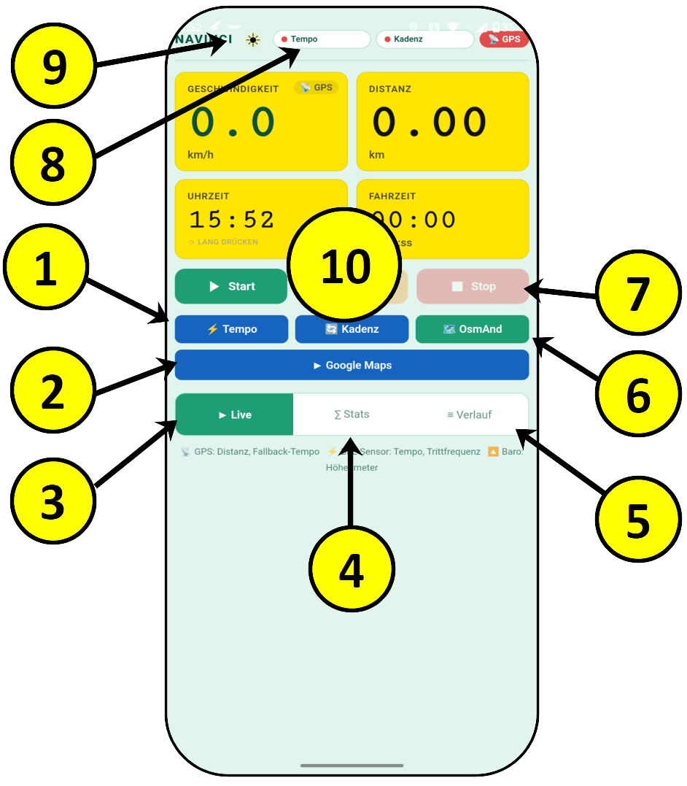

# Navinci — Bedienungsanleitung

## Screen 1: Live

* * *

### ① Start

Startet die Fahrtaufzeichnung. Distanz, Fahrzeit und Höhenmeter werden ab diesem Moment aufgezeichnet.

* * *

### ② Sensor verbinden

Startet die Bluetooth-Suche nach einem CSC-Sensor (Cycling Speed and Cadence). Nach erfolgreicher Verbindung liefert der Sensor Geschwindigkeit und Trittfrequenz. Ein erneuter Tipp auf den Button trennt den Sensor wieder.

**Hinweis:** Bluetooth muss eingeschaltet sein. Die Suche läuft maximal 30 Sekunden.

* * *

### ③ Live (Navigation)

Wechselt zu Screen 1 — der Echtzeit-Anzeige während der Fahrt. Dieser Screen ist beim App-Start standardmäßig aktiv.

* * *

### ④ Stats (Navigation)

Wechselt zu Screen 2 mit Statistiken der aktuellen Fahrt sowie Gesamtauswertungen und Einstellungen.

* * *

### ⑤ Verlauf (Navigation)

Wechselt zu Screen 3 mit der Übersicht aller gespeicherten Fahrten.

* * *

### ⑥ OsmAnd

Öffnet die OsmAnd-Navigations-App. Ist Navinci bereits im Split-Screen-Modus, öffnet OsmAnd automatisch in der zweiten Bildschirmhälfte.

**Split-Screen-Tipp:** Navinci zuerst über die Recents-Taste in den Split-Screen setzen, dann diesen Button tippen — OsmAnd erscheint automatisch daneben.

* * *

### ⑦ Stop

Beendet die Fahrtaufzeichnung nach Bestätigung und speichert die Fahrt im Verlauf.

**Hinweis:** Fahrten unter 0,05 km werden nicht gespeichert.

* * *

### ⑧ Bluetooth-Verbindung

Zeigt den aktuellen Verbindungsstatus des BLE-Sensors:

- 🔴 **Getrennt** — kein Sensor verbunden
- 🟡 **Suche…** — Bluetooth-Scan läuft
- 🟢 **Verbunden** — Sensor aktiv, liefert Tempo und Trittfrequenz

* * *

### ⑨ Display-Wachmodus

Verhindert die automatische Bildschirmabschaltung während der Fahrt. Ein Tipp aktiviert bzw. deaktiviert den Wachmodus. Im aktiven Zustand leuchtet das Symbol hell auf.

* * *

### ⑩ Uhrzeit / Höhe / Trittfrequenz (Toggle)

Durch **langes Drücken** (ca. 0,6 Sekunden) auf die entsprechende Karte wird zwischen den Anzeigen umgeschaltet:

- **Uhrzeit**
- **Höhe** in Metern — aus Barometer oder GPS mit Kalman-Filter
- **Trittfrequenz** in rpm — vom BLE-Sensor

Die gewählte Ansicht bleibt beim nächsten App-Start erhalten.

* * *

Der Sensor hat Vorrang wenn er mit Bluetooth verbunden ist. Ein Klick erzwingt GPS auch wenn der Sensor verbunden ist — nützlich zum Vergleichen während der Fahrt.

Dies ist die flexibelste Lösung: Normale Nutzung, aber manueller Eingriff jederzeit möglich.

Der Button ist sichtbar:

| Farbe | Symbol | Bedeutung |
| --- | --- | --- |
| 🔴 Rot | 📡  | Kein Sensor — GPS aktiv |
| 🟢 Grün | ⚡   | Sensor verbunden — Automatik |
| 🟡 Gelb | 📡  | GPS-Override aktiv |

&nbsp;

**Energieverbrauch GPS vs. Bluetooth:**

**BLE-Sensor benötigt deutlich weniger Energie** — das "LE" in BLE steht für *Low Energy*.

|     | GPS | BLE-Sensor |
| --- | --- | --- |
| Stromverbrauch | hoch (Dauerbetrieb Empfänger) | sehr gering |
| Update-Rate | ~1 Hz | ~1–4 Hz (ereignisgesteuert) |
| Akkuverbrauch Handy | spürbar (bekannter GPS-Drain) | kaum messbar |
| Zusatzverbrauch | Satellitenempfang, Positionsberechnung | nur kurze Funkpakete |